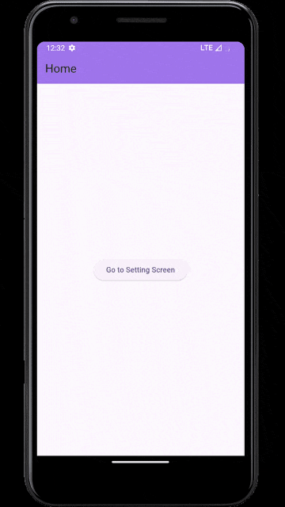

# 🌐 Flutter Internet Connectivity Checker  

A **cross-platform** Flutter app that monitors internet connectivity in **real-time** using **Provider** for state management. It works seamlessly on **Android, iOS, Web, Windows, macOS, and Linux**.  

 

## 🚀 Features  

✅ **Cross-Platform Support** – Works on Android, iOS, Web, Windows, macOS, and Linux.  
✅ **Real-Time Monitoring** – Detects internet connection changes instantly.  
✅ **State Management** – Uses **Provider** for efficient handling of connectivity state.  
✅ **Lightweight & Efficient** – Optimized for performance with minimal resource usage.  
✅ **User Alerts** – Displays messages when the connection is lost or restored.  

## 📥 Download APK  
🔗 [Download APK](assets/internet_connectivity_check.apk)  

## 🚀 Getting Started  

## 🪄 Prerequisites  
Before you begin, ensure you have the following installed:  

- ✅ **Flutter SDK** – [Install Flutter](https://flutter.dev/docs/get-started/install)  
- ✅ **Dart SDK** – Included with Flutter  
- ✅ **Android Studio or VS Code** – For development & debugging  
- ✅ **Android/iOS Emulator or Physical Device** – To run the app  

## 🛠️ Installation  

1. **Clone the repository:**  
   ```sh
   git clone https://github.com/AdityaRaj9889/internet_connectivity_check.git
   cd flutter-internet-checker
